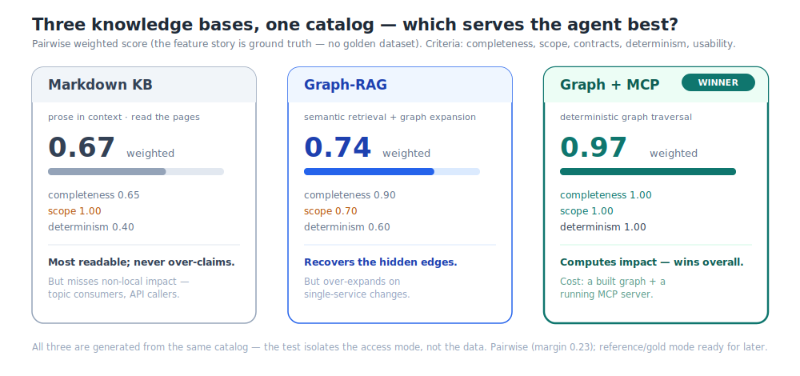

# sdd-knowledgebase-evaluation

Three ways to give an LLM agent knowledge of your microservices — **Markdown**, **Graph-RAG**, and
**Graph + MCP** — built from the same source and **measured** on one question that matters for
feature→story generation: *what does this feature actually touch?*



## TL;DR

Pairwise comparison — the **feature story is the ground truth** (no golden dataset; the framework
stays open for reference/gold mode later). Weighted scores over 6 feature tasks:

| Approach | Completeness | Scope | Determinism | **Weighted score** |
|---|---:|---:|---:|---:|
| Markdown KB | 0.65 | 1.00 | 0.40 | 0.67 |
| Graph-RAG | 0.90 | 0.70 | 0.60 | 0.74 |
| **Graph + MCP** | **1.00** | **1.00** | **1.00** | **0.97** |

**Graph + MCP wins** (margin 0.23) — it *computes* impact by graph traversal, so it's complete,
exact, and repeatable. Markdown is the most readable and never over-claims but misses non-local
impact; Graph-RAG recovers those edges but over-expands on local changes.
Full verdict → [`llm-as-judge/results/comparison-report.md`](llm-as-judge/results/comparison-report.md) ·
beginner-friendly blog post → [`docs/blog/blog-knowledge-bases-for-ai-agents.md`](docs/blog/blog-knowledge-bases-for-ai-agents.md).

## Quickstart

```bash
# 1. Build all three KBs from the catalog and start the two MCP servers
#    (or run the /build-all-kbs Windsurf workflow)
ROOT="$(pwd)"; CAT="$ROOT/knowledge-bases/graph-mcp/catalog"
( cd knowledge-bases/graph-mcp/builder/graph-builder && mvn -q exec:java -Dexec.args="$CAT" \
  && mvn -q exec:java -Dexec.mainClass=com.ganesh.catalog.graph.MarkdownGenerator -Dexec.args="$CAT $ROOT/knowledge-bases/markdown/kb" )
( cd knowledge-bases/graph-mcp/mcp-server && CATALOG_ROOT="$CAT" mvn -q spring-boot:run & )   # :3002
( cd knowledge-bases/graph-rag/rag-mcp && CATALOG_ROOT="$CAT" RAG_REBUILD=true mvn -q spring-boot:run & )  # :3003
```

Then, in Windsurf/Devin:
```
/feature-to-story KB-201 --kb=markdown
/feature-to-story KB-201 --kb=graph-rag
/feature-to-story KB-201 --kb=graph-mcp
/judge-knowledgebases all
```

**Prereqs:** Maven + a JDK (17–24). The Graph-RAG embeddings are local (all-MiniLM) — **no API key**.

## What's in here

```
microservices/            2 Spring Boot services — the source of truth (offline use only)
knowledge-bases/
  markdown/               approach 1 — prose pages (generated, never drifts)
  graph-rag/              approach 2 — vector index + rag-mcp (local embeddings, :3003)
  graph-mcp/              approach 3 — catalog + graph-builder + catalog-mcp (:3002)
feature-to-story/         spec template (KB-only generation)
llm-as-judge/
  tasks/<ID>/             6 feature tasks (story = ground truth) + gold-impact.json (future reference anchor)
  specs/KB-201/           the flagship feature generated three ways (worked example)
  results/                comparison-report.{md,json} (the pairwise verdict)
docs/                     state-of-the-art survey · blog post · diagrams (SVG) · judge-output-schema.json
.devin/  (authored as .windsurf/, mirrored here)
  workflows/              build-kb-*, build-all-kbs, feature-to-story, judge-knowledgebases
  rules/                  kb-isolation (no code at query time) · judge-rubric (the constitution)
```

## The experiment, in three rules

1. **Same data, three access modes.** All KBs are generated from one catalog, so the test isolates
   *how the agent reads*, not *what it knows*. → [`docs/state-of-the-art.md`](docs/state-of-the-art.md)
2. **No code at query time.** `/feature-to-story` reads only the KB — never `microservices/`. Enforced
   by [`.windsurf/rules/kb-isolation.md`](.windsurf/rules/kb-isolation.md). That's the whole point: we're
   grading the knowledge base, not the model's ability to read Java.
3. **The story is the ground truth (pairwise).** The judge compares the three specs against the
   feature story with bias controls (position, verbosity, charity) — no hand-labelled answer key to
   bias the result. Stays open for **reference mode** (score vs an independently-authored
   `gold-impact.json`) later — [`.devin/rules/judge-rubric.md`](.devin/rules/judge-rubric.md).

## How the three differ

| | Markdown | Graph-RAG | Graph + MCP |
|---|---|---|---|
| Access | read prose pages | `rag_search()` semantic + 1-hop graph | `get_dependents()` / `impact_report()` |
| Finds "who consumes this topic?" | ✗ (not on the page you read) | ✓ (topic chunk + graph) | ✓ (reverse lookup) |
| Over-claims on local changes | ✗ never | ✓ sometimes | ✗ never |
| Infra | none | rag-mcp :3003 | catalog-mcp :3002 |

See each folder's README in [`knowledge-bases/`](knowledge-bases/README.md).

## Reproduce / extend

Re-run `/judge-knowledgebases all` to regenerate the verdict. Add a task by dropping
`llm-as-judge/tasks/<ID>/story.md` and running the three `/feature-to-story` modes + the judge.
For variance, run each cell multiple times and rotate spec order (position-bias control).

---

### Notes
- **Windsurf vs `.devin/`:** workflows/rules are authored under `.windsurf/`; some environments mirror
  them to `.devin/`. Either works.
- **JDK:** the demo services target Java 17 and compile on JDK 24; the MCP servers run on JDK 24
  (verified). To run the services' `@SpringBootTest` suites, use JDK 17/21.
- **Clean repo:** this is a fresh `git init` with no commits — review, then `git add` when ready.
