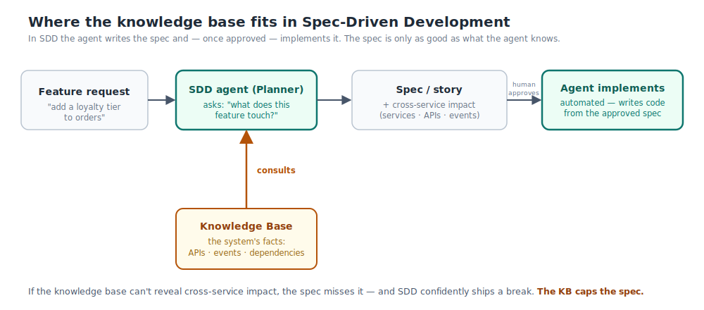
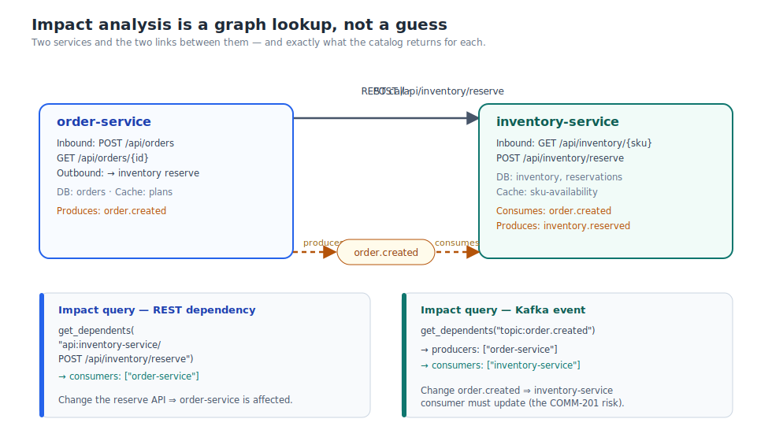
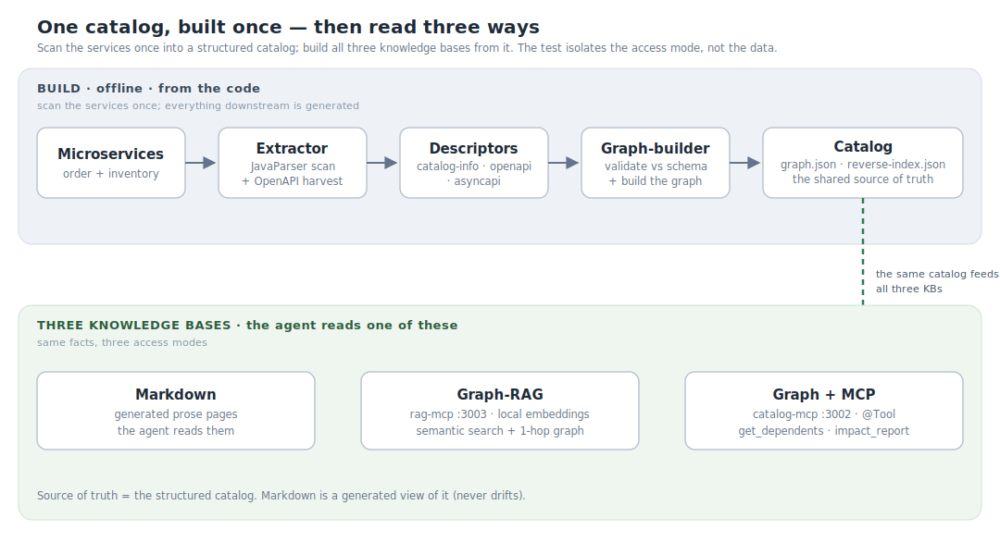
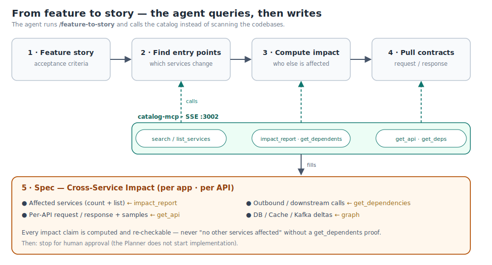
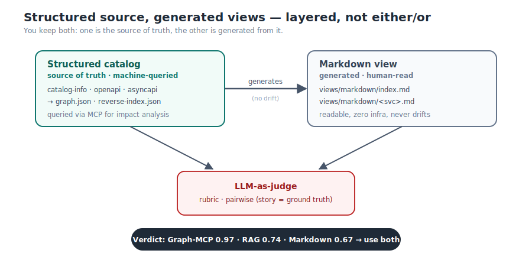

# Teaching an AI Agent to Know Your Microservices: Markdown, RAG, and a Deterministic Knowledge Base

*A beginner-friendly guide to knowledge bases for AI agents in **Spec-Driven Development** — with a
head-to-head test of three ways to build one: Markdown, Graph-RAG, and a deterministic knowledge
graph (behind MCP tools) — the one that wins.*

## TL;DR

Before writing code, a good AI agent should answer one question about a feature: *what does this
change touch?* To answer it, the agent needs a **knowledge base** — its memory of your services. I
built that knowledge base three ways and measured them. A knowledge **graph the agent can query**
beat both plain markdown docs and semantic search (RAG), because "what depends on what" is a graph
question.

```
+---------------+--------------+---------------------+------------+--------+
| Approach      | Completeness | Avoids false alarms | Repeatable | Score  |
+---------------+--------------+---------------------+------------+--------+
| Markdown docs |     0.65     |        1.00         |    0.40    |  0.67  |
| Graph-RAG     |     0.90     |        0.70         |    0.60    |  0.74  |
| Graph + MCP   |     1.00     |        1.00         |    1.00    |  0.97  |  <- winner
+---------------+--------------+---------------------+------------+--------+
```

---

## The question every change starts with

You work on a platform with lots of microservices. A feature lands — *"add a loyalty tier to
orders"* — and before any code, someone has to answer the scariest question in distributed systems:

> **What does this actually touch?**

Which services, which APIs, which events, which databases. Miss one and you ship a change to one
service that quietly breaks another three hops away.

More and more, we ask an **AI agent** to answer this — and to write the plan before any code is
written. That practice has a name.

---

## What is Spec-Driven Development (SDD)?

**Spec-Driven Development** is a simple idea: before touching code, the agent writes a short **spec**
for the change — the goal, the scope, and crucially the **impact**: which services, APIs, and events
it will affect. A human reviews the spec, and *then* implementation happens. The spec is the
contract, and it catches problems while they're still cheap to fix.

But to write that spec, the agent has to know your system. And here's the catch that runs this whole
article:



The spec is only as good as what the agent knows. If its knowledge can't reveal that changing an
event breaks a downstream listener, **the spec won't mention it** — and SDD confidently ships a
break. In other words: **the knowledge base caps the spec.** So the real question isn't "is the agent
smart?" It's *"does the agent have the right knowledge, in a shape it can use?"*

---

## So what is a "knowledge base"?

If you've heard the term and just nodded along, here's the plain version.

A **knowledge base (KB)** is the set of facts the agent looks up to make a decision. For an agent
working on your platform, it's **everything it knows about your services**: their APIs, the events
they publish and consume, what they call, what data they own. Think of it as the agent's *memory of
your architecture*. The agent wasn't trained on your private services — so without a KB, it can't
reason about them at all.

---

## Where it breaks today

Most teams keep that knowledge as a folder of `README.md` files — one per service, written in prose:

> *"order-service creates orders and publishes an `order.created` event. It calls inventory-service
> to reserve stock."*

Great for humans. So we point the agent at all of them and ask for a feature's impact — and we get a
confident, **incomplete** answer.

**Here's the trap.** Say the feature is *add a `reservedQty` field to the `order.created` event.* The
agent reads `order-service.md`, sees "publishes `order.created`," and reports "order-service is
affected." ✅ But — **who *consumes* that event?** That fact lives on a *different* page the agent
never opened, so it never flags that the consumer (inventory-service) must change too. That's exactly
what the spec needed to catch, and it's gone.

This isn't the agent being dumb — it's the docs being the wrong **shape**. Prose has no
"who-depends-on-me" links to follow. "Who consumes this event?" and "who calls this API?" are
invisible from the page you happen to read first. Add in drift (docs rot) and size (40 long pages
won't fit the prompt), and prose just doesn't scale to an AI reader.

---

## The fix: think in graphs, not pages

The shift is to picture your services not as documents but as a small **graph** of who-talks-to-whom:



Now "who breaks if `order.created` changes?" is a one-line answer: follow the *consumes* edge to
inventory-service. "Who calls the reserve API?" — follow the edge the other way. The relationships
the prose hid are now first-class. Impact becomes a **lookup**, not a guess.

---

## Three ways to give the agent that graph

To compare fairly, I built **three** knowledge bases from the **same** source — scan the services
once into a structured catalog (APIs, events, dependencies), then expose it three ways. Same data, so
whatever wins, it's the *way the agent reads it* that won.



**1. Markdown docs** — generated per-service pages (so they never drift). The agent just reads prose.
Simple, but it still can't follow "who consumes this."

**2. Graph-RAG** — *RAG* (Retrieval-Augmented Generation) is the usual way to give an LLM new
knowledge: turn each fact into a vector and fetch the ones closest to the question — semantic search
into the prompt. **Graph-RAG** adds one step: after retrieving, **follow the graph one hop** to pull
in neighbours (the caller, the event's consumers). Nice bonus for Java teams — with Spring AI you can
embed locally, no API key.

**3. Graph + MCP** — skip retrieval; let the agent *query the graph directly*. **MCP** (Model Context
Protocol) is just a standard for "tools an AI can call." With Spring AI a tool is one annotation:

```java
@Tool(description = "Who is affected if this API / topic / service changes?")
public Object get_dependents(String ref) { ... }   // ref = "topic:order.created"
```

The agent calls it and gets an exact, repeatable answer — impact is **computed**, not guessed:

```
get_dependents("topic:order.created")  →  consumers: [inventory-service]
```

Put together, that's how the agent turns a feature into a spec — query the catalog, then write:



---

## The test, and the result

Two rules kept it honest: the agent saw **only the knowledge base, never the code** (or we'd be
testing the model, not the KB), and an **AI judge compared the answers** against the feature itself —
the way you'd compare two pull requests against a ticket — with guardrails so a vague "might affect…"
counts as a miss.


The graph-and-tools approach won clearly, and the two runners-up failed in **opposite** ways:

- **Markdown is cautious but blind.** It never invents impact, but it *missed* things — it saw the
  event's producer and never asked who consumes it.
- **Graph-RAG is eager.** The graph hop found the hidden consumers and callers Markdown missed — but
  on small, single-service changes it sometimes dragged in a neighbour that *wasn't* affected.
- **Graph + MCP is both** — complete *and* precise — because it follows the real graph instead of
  reading prose or guessing from similarity.

> **Markdown misses, RAG over-reaches, the graph computes.**

And the gap only grows with scale: with just two services there are barely any hidden links to miss,
so this demo *understates* the winner's lead.

---

## You don't have to pick one

They're all generated from the same catalog, so treat them as different front doors, not rivals:
use **Graph + MCP** as the engine for "what does this touch?", keep **Markdown** for humans to read
(it never drifts), and reach for **Graph-RAG** when the question is fuzzy and you want recall.



---

## Takeaways

1. **In Spec-Driven Development, the knowledge base caps the spec.** Fix the KB before blaming the agent.
2. **"What does this touch?" is a graph question** — answer it with a graph, not by reading paragraphs.
3. **MCP turns a graph lookup into a tool the agent calls** — in Spring AI, one `@Tool` annotation.
4. **Build the KB from code, not by hand** — generated views don't drift, and you get a fair comparison.
5. **Measure your knowledge base; don't assume it.** Completeness, false-alarm rate, and repeatability are all scorable — in an afternoon.

---

*The full project — two Spring Boot services, all three knowledge bases, the test features, and the
AI judge — is on GitHub:
[github.com/ganesh/sdd-knowledgebase-evaluation](https://github.com/ganesh/sdd-knowledgebase-evaluation)
(link placeholder). Clone it and check my numbers.*
